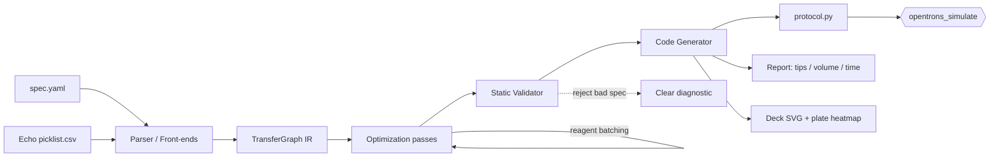

# PipetteC — a compiler for liquid-handling protocols

> Write a high-level experiment spec. Get a **validated, tip-optimized Opentrons OT-2 protocol** that passes the official simulator in CI.

<!-- Badges (README-ready; wire up after CI exists) -->


-blue)


*(Working name: **PipetteC**, CLI `pipettec` — chosen to echo `protoc`/`gcc`. Placeholder; trivially renamable.)*

---

## TL;DR (read this in 30 seconds)

**PipetteC compiles a one-page YAML experiment spec — or a real Echo picklist CSV — into a runnable Opentrons OT-2 Python protocol.** It's built like a real compiler: `spec → intermediate representation → optimization passes → code generation`. The optimizer applies the **published tip-saving formulation** (liquid handling as a capacitated vehicle-routing problem) to cut disposable pipette tips (e.g. *384 tips → 96 tips, −75%*), with a machine-checked guarantee that the optimized protocol delivers exactly the same liquid as the naive one. Every protocol it emits is validated by Opentrons' own `opentrons_simulate` on every commit, so correctness isn't a claim — it's a green check.

No robot required: Opentrons ships a free simulator, so the entire project runs in CI on GitHub Actions with zero hardware.

**Not a new idea — a cleanly executed one.** Compilers for liquid handling exist (Roboliq), and tip minimization is published operations-research (see [Prior Art](#prior-art--how-this-differs)). What doesn't exist is *this* artifact: a focused, typed, MIT-licensed **OT-2** compiler with an Echo-picklist front-end and a simulator-validated CI gate, legible to a non-specialist in a minute. The contribution is engineering and packaging, not algorithmic novelty — and the README says so.

---

## What this project demonstrates (recruiter cheat-sheet)

| Skill | Where it shows up in this repo |
| --- | --- |
| **Compiler engineering** | A real IR, discrete optimization passes, code generation, and a *semantics-preservation* invariant proven by tests — not a script that string-templates Python. |
| **Applied operations research** | Implements the published CVRP/LP tip-saving formulation as compiler passes; auto-generated before/after benchmark table where tip reuse, multi-channel packing, and reordering each report their own delta. |
| **Domain fluency (lab automation)** | Correct use of the Opentrons API, deck geometry, labware, tip/well capacities, contamination rules, and the industry-standard Echo picklist format. |
| **Testing rigor** | Property-based testing (Hypothesis) that fuzzes thousands of specs; snapshot tests; a live simulator gate; corpus validation against real published protocols. |
| **Defensive/static analysis** | A validator that *rejects* impossible or unsafe specs with clear diagnostics before any robot would move. |
| **Product & communication** | CLI, generated deck-layout diagrams and plate-map heatmaps, a cost/resource report, and a README a non-specialist can follow. |

---

## The 30-second demo (target UX)

```bash
$ pipettec compile examples/dose_response.yaml -o dose_response.py --report
✓ parsed spec            (2 compounds × 8 points × 3 replicates = 48 wells)
✓ lowered to IR          (144 transfers)
✓ optimization passes    tips 144 → 32 (-78%)  ·  aspirations 144 → 20  ·  est. time 19m → 11m
✓ static validation      no capacity / collision / tip-exhaustion errors
✓ codegen                dose_response.py
✓ opentrons_simulate     PASSED (exit 0)

$ opentrons_simulate dose_response.py     # the official tool agrees
... Dropping tip into A1 of Opentrons Fixed Trash on slot 12
```

Input the user wrote:

```yaml
# examples/dose_response.yaml
template: serial_dilution
compounds: [DrugA, DrugB]
points: 8
replicates: 3
top_conc_uM: 100
factor: 3          # 3-fold serial dilution
diluent: DMSO
```

---

## Architecture



**Design principle — the optimizer is the spine, not a feature.** Because optimization is expressed as passes over an IR, "naive mode" (passes off) and "optimized mode" (passes on) run the *same* pipeline. The before/after benchmark is therefore a byproduct of the architecture, computed apples-to-apples from one source of truth — not a hand-tuned marketing number.

---

## Prior art & how this differs

Being explicit about prior work is a deliberate credibility choice: the concept and the core algorithm both exist in the literature, and pretending otherwise would be the fastest way to lose a knowledgeable reviewer. What follows is what exists, and the specific gap this project fills.

### What already exists

| Prior work | What it is | Why it's not this project |
| --- | --- | --- |
| **Roboliq / PR-PR** ([repo](https://github.com/ellis/roboliq), [ACS Synth Biol 2018](https://pubs.acs.org/doi/abs/10.1021/acssynbio.8b00021)) | An AI-planning *compiler* from high-level portable protocols to optimized robot programs. The closest conceptual analog. | Scala/JavaScript, **Tecan-only (no OT-2)**, research-grade, not maintained as a clean, approachable artifact. |
| **Tip minimization as CVRP/LP** ([NAR Genomics 2022](https://pmc.ncbi.nlm.nih.gov/articles/PMC9074407/), [Digital Discovery 2025](https://arxiv.org/html/2506.02795)) | Published operations-research formulations (capacitated vehicle routing / linear programming) that minimize pipette tips, with code. | The optimization is *solved research*. This project **applies** it, it does not claim to invent it — and validates the result end-to-end in a simulator. |
| **PyLabRobot** ([repo](https://github.com/PyLabRobot/pylabrobot), [paper](https://pmc.ncbi.nlm.nih.gov/articles/PMC10369895/)) | Popular hardware-agnostic Python **SDK** of atomic commands; supports OT-2. | An interface/runtime, **not a spec-compiler**; it does not optimize or accept Echo picklists. Complementary, not competing. |
| **Autoprotocol / Antha / LabOP** ([Autoprotocol](http://autoprotocol.org/), [LabOP](https://dl.acm.org/doi/10.1145/3604568)) | Open *standards* for representing protocols; LabOP can execute via Opentrons. | Committee-scale representation standards, not a focused optimizing tool with a metric headline. |
| **Opentrons Protocol Designer** ([designer](https://designer.opentrons.com/)) | Official no-code GUI that generates protocols. | Closed-source, GUI, no optimization headline, not scriptable/testable as engineering. |

### The gap this fills

No single, focused, well-engineered repo combines all of: **OT-2 target · high-level spec + Echo-picklist front-ends · IR with optimization passes · the official simulator as a CI gate · modern typed Python · recruiter-legible in a minute.** The pieces are scattered across research code, SDKs, and standards bodies; nobody has assembled *this* one cleanly. Echo-picklist→OT-2 specifically appears to be unserved.

### Honest positioning (applied throughout this repo and its README)

- The **compiler concept** is prior art (Roboliq) — we cite it.
- The **tip optimization** is prior research (CVRP/LP) — we cite it and *apply* rather than claim to invent it.
- The **contribution is execution**: OT-2 focus, simulator-validated CI, a clean codebase, and an Echo round-trip — packaged as something a person can read, run, and trust in minutes.

The least-trodden, most differentiating surfaces — worth leaning the headline into — are the **static validator/linter** (reject unsafe specs before the robot moves) and the **simulator-as-CI golden-test harness**. These are far less explored than tip-saving and are where this repo can be genuinely distinctive rather than merely well-made.

---

## Scope

### In scope (v1)

**Two front-ends, one IR:**
1. **YAML templates** a human writes.
2. **Echo picklist CSV** import — the de-facto industry format (`source well, dest well, volume` rows). This is the "real-format-in" credibility trophy.

**Templates (each is a *lowering* onto the shared IR & passes):**
- `serial_dilution` — dose–response plates (the flagship vertical slice)
- `plate_normalization` — normalize concentrations/volumes across a plate
- `cherry_pick` / `hit_pick` — arbitrary source→dest transfers (also the Echo picklist target)
- `reformat_96_to_384` — plate reformatting / consolidation
- `pcr_setup` — mastermix + template distribution

**Optimization passes (each independently benchmarked):**
- **Tip reuse** — one tip serves many transfers when the source is identical and contamination rules permit (largest tip win).
- **Multi-channel packing** — collapse 8 aligned single-channel transfers into one 8-channel move on 96/384 plates.
- **Source-grouped reordering** — order transfers to minimize tip pickups and deck travel.
- **Reagent batching (distribute)** — one aspirate feeding many dispenses.

**Static validator (rejects before the robot would fail):**
- Volume exceeds tip or well capacity
- Aspirate from an empty/undefined source
- Tip exhaustion (more tips needed than loaded)
- Deck collisions / duplicate slot assignment / missing labware
- Cross-contamination violations introduced by unsafe tip reuse

**Outputs:**
- `protocol.py` (Opentrons API v2, OT-2)
- Resource report: tips consumed, reagent volume per source, estimated wall-clock
- Visuals: deck-layout SVG + plate-map heatmap

**Quality infrastructure:**
- CLI (`compile`, `validate`, `report`, `render`)
- pytest unit + snapshot tests, Hypothesis property tests, simulator gate, corpus check
- GitHub Actions CI

### Out of scope (v1) — stated so the boundary is honest

- **Opentrons Flex** and any robot other than the OT-2 (`opentrons` is pinned `<9`; see Risks).
- **Live hardware execution** — simulator only.
- **Fetching biology datasets** (PubChem / ChEMBL / LINCS). A real screen's *layout* is expressible as a plate map / picklist; live data-fetching adds flakiness for no compiler value. Listed as "possible future inputs," not built.
- **Byte-for-byte matching hand-written protocols.** We prove *semantic* equivalence and simulator-cleanliness, not textual identity (see Testing).
- **GUI.** CLI + generated images only.

---

## Component specifications

### The IR: `TransferGraph`

The single source of truth between front-ends and codegen. Conceptually:

- **Resources:** labware (type, deck slot), instruments (pipette model, mount, tip racks), reagents/sources.
- **Transfers:** ordered list of `(source_well, dest_well, volume, tip_policy)` operations.
- **Tip classes:** an equivalence relation declaring which transfers *may* share a tip without violating contamination rules (e.g. distributing one clean reagent).

Every front-end lowers to this; every pass rewrites it; codegen walks it. Passes never touch YAML or Python text.

### The correctness invariant (the heart of the project)

Optimization must **never** change what liquid ends up where. Formally, for any input spec:

1. **Delivery-equivalence:** the optimized IR delivers, for every `(source, dest)` pair, the *same total volume* as the naive IR. (Machine-checked by summing volumes per pair before/after each pass.)
2. **Contamination-safety:** a tip is reused across two transfers only if they belong to the same declared tip class. (Machine-checked; an unsafe reuse is a validator error, not a silent optimization.)

These two properties are asserted by property-based tests over randomly generated specs. This is what makes the optimizer *trustworthy* rather than merely *fast*.

### Front-ends

- **YAML:** schema-validated (jsonschema / pydantic). Clear errors on malformed specs.
- **Echo picklist CSV:** tolerant reader for the common column variants (`Source Well`, `Destination Well`, `Transfer Volume`, plate IDs). Lowers directly to a `cherry_pick`-style TransferGraph, then runs the full optimizer — so a raw picklist comes out optimized.

### Validator

Runs on the IR *after* optimization, *before* codegen. Emits structured diagnostics (`code`, `message`, `offending element`) and a non-zero exit. Each diagnostic class has a dedicated "reject this bad spec" test.

### Code generator

Emits idiomatic Opentrons API v2 Python targeting the OT-2, `apiLevel` ~2.15, deterministic output (stable ordering → clean snapshot diffs).

### Reporting & visuals

- **Report:** tips consumed, reagent volume per source, estimated wall-clock (clearly labelled a *model estimate*, not a hardware measurement).
- **Deck SVG:** slots, labware, pipettes.
- **Plate heatmap:** volumes/concentrations per well (matplotlib).

---

## Build plan — staged so every milestone is a shippable, honest repo

Each milestone ends green (CI passing) and self-contained. A reader who stops at any milestone still sees a complete project.

### M0 — Foundation & de-risk ✅ *(verified)*
- Python 3.12 venv, `opentrons==8.8.2` pinned, `opentrons_simulate` confirmed passing a real OT-2 protocol (exit 0). *Done during scoping.*
- **Exit:** the simulator gate provably works on this environment.

### M1 — Vertical slice (a complete project on its own)
- `serial_dilution` YAML → IR → **tip-reuse pass** → validator → codegen → `opentrons_simulate` green in GitHub Actions.
- pytest unit tests, one snapshot test, first Hypothesis property test, first before/after number in README.
- **Exit:** `pipettec compile examples/dose_response.yaml` produces a simulator-passing protocol in CI, with a real tip-reduction metric.

### M2 — The two things reviewers stop for
- **Echo picklist CSV** front-end (round-trip: real picklist → optimized protocol that simulates).
- **Full optimization-pass suite** (multi-channel packing, reordering, batching) + auto-generated **metrics table** in the README.
- **Exit:** metrics table generated by the tool; picklist round-trip test green.

### M3 — Breadth (proves it's a compiler, not one routine)
- Remaining templates: `plate_normalization`, `cherry_pick`, `reformat_96_to_384`, `pcr_setup`.
- Each adds only a lowering; passes/validator/codegen are reused.
- **Exit:** all templates simulate cleanly; property tests fuzz across all templates.

### M4 — Static validator with friendly diagnostics
- All rejection classes implemented, each with a "rejects bad spec with clear message" test.
- **Exit:** curated gallery of bad specs, each rejected with a readable diagnostic and non-zero exit.

### M5 — Visuals, cost report, polish
- Deck SVG + plate heatmap per example; resource/cost report; README above-the-fold with metrics table + a rendered deck diagram; corpus check against a few published protocols.
- **Exit:** README is legible to a non-specialist in under a minute; images render on GitHub.

---

## Deliverable success criteria

The project is **done** when every box below is checkable in CI or in the repo. Thresholds are concrete on purpose.

### Correctness (non-negotiable gates)
- [ ] **Simulator gate:** every generated example protocol passes `opentrons_simulate` with exit 0, enforced in CI on every push/PR.
- [ ] **Delivery-equivalence:** a property test asserts optimized IR delivers identical per-`(source,dest)` volumes as naive IR, across **≥ 500** generated specs, zero counterexamples.
- [ ] **Valid-spec property:** **≥ 500** Hypothesis-generated valid specs each compile to a protocol that simulates cleanly.
- [ ] **Invalid-spec property:** generated invalid specs are **always** rejected with a structured diagnostic and non-zero exit — never a crash, never a bad protocol emitted.
- [ ] **Snapshot stability:** each template has a pinned output snapshot; unintended codegen changes fail CI.

### Optimization (applied, benchmarked, cited)
- [ ] Tool emits a **before/after table** (naive vs optimized) computed from one IR, covering **tips**, **aspirations/steps**, and **estimated time**.
- [ ] On the reference dose–response benchmark, tip reduction is **≥ 60%** (target ~75%), reproduced by a committed benchmark script.
- [ ] Each pass has a unit test proving it (a) reduces its target metric and (b) preserves the correctness invariant.
- [ ] The tip-saving passes **cite the CVRP/LP source formulation** in code and docs; no novelty is claimed for the algorithm.

### Front-ends & templates
- [ ] All **5 templates** compile and simulate.
- [ ] **Echo picklist CSV** round-trip: a real (public/textbook) picklist compiles to an optimized protocol that simulates.

### Validator
- [ ] **All 5 rejection classes** (capacity, empty-source, tip-exhaustion, deck-collision, contamination) implemented, each with a dedicated failing-input test producing a clear message.

### Engineering & presentation
- [ ] **CI green** on GitHub Actions (lint + type-check + full test suite + simulator gate).
- [ ] Test **coverage ≥ 85%** on the compiler core (parser, IR, passes, validator, codegen).
- [ ] **CLI**: `compile`, `validate`, `report`, `render` all documented with `--help` and covered by an integration test.
- [ ] **Visuals**: deck SVG + plate heatmap generated for at least the flagship example and embedded in the README.
- [ ] **README** opens with the pitch, the metrics table, a rendered deck diagram, and the "what this demonstrates" table — legible to a non-lab recruiter in under a minute.
- [ ] **README carries a "Prior Art & how this differs" section** that cites Roboliq, the CVRP/LP tip papers, and PyLabRobot — claiming execution, not algorithmic novelty.
- [ ] **Reproducibility**: `pip install -e .` + `pytest` + `opentrons_simulate` runnable from a clean clone following the README alone.

---

## Benchmarking methodology (so the numbers are defensible)

- **Baseline ("naive"):** the same compiler with all optimization passes disabled — one fresh tip per transfer, single-channel, source-naive ordering. This is a faithful stand-in for a straightforward hand translation.
- **Optimized:** all passes enabled.
- Both run from the **identical IR**, so the comparison is apples-to-apples and cannot be cherry-picked.
- **Time estimate** is a transparent model (per-aspirate/dispense/tip-change/move constants), clearly labelled an estimate. Tips and step counts are exact.
- The benchmark script is committed; the README table is regenerated from it, never hand-edited.

---

## Testing strategy

| Layer | Tool | Asserts |
| --- | --- | --- |
| Unit | pytest | each pass reduces its metric **and** preserves the invariant; parser/validator edge cases |
| Property | Hypothesis | valid spec → simulates; invalid spec → clean rejection; optimize → delivery-equivalent |
| Snapshot | pytest + files | codegen output is stable per template |
| Integration | pytest | full CLI → `opentrons_simulate` exit 0 |
| Corpus | pytest | a few published OT-2 protocols simulate under our pinned version (environment sanity) |

---

## Risks & mitigations

| Risk | Status | Mitigation |
| --- | --- | --- |
| **Simulator won't accept OT-2 protocols** | **Resolved** | `opentrons` 9.x split OT-2 into a separate app and its `opentrons_simulate` refuses OT-2 (`RuntimeError`). **Pinned `opentrons>=8.8,<9` (8.8.2)**, verified passing on Python 3.12. Recorded as a hard constraint. |
| **"This has been done before" (Roboliq, CVRP tip papers, PyLabRobot)** | Mitigated by positioning | A [Prior Art](#prior-art--how-this-differs) section cites all of it; we claim *execution/packaging*, not novelty. Differentiators: OT-2 focus, Echo round-trip, simulator-as-CI, clean typed code. |
| "Optimization" is unconvincing / looks like a toy | Mitigated by design | IR + passes + committed benchmark; delivery-equivalence proof makes gains *trustworthy*, not just claimed. |
| Scope creep (biology datasets) | Mitigated | Explicitly out of scope; Echo picklist is the single real-format input. |
| Brittle golden-diff vs human protocols | Mitigated | Snapshot our *own* output; treat human protocols as a corpus we simulate as cleanly as. |
| Opentrons API drift | Mitigated | Version pinned; corpus test detects environment mismatch. |

---

## Tech stack

- **Language:** Python 3.12
- **Robot API / simulator:** `opentrons>=8.8,<9` (8.8.2), OT-2, API v2
- **Spec/validation:** YAML + pydantic/jsonschema
- **Testing:** pytest, Hypothesis, coverage
- **Visuals:** matplotlib (heatmap), SVG (deck)
- **CI:** GitHub Actions
- **Tooling:** ruff (lint), mypy (types)

---

## Proposed repository layout

```
pipettec/
├── README.md                 # recruiter-facing; metrics + diagram above the fold
├── PROJECT.md                # this document
├── pyproject.toml            # pins opentrons>=8.8,<9
├── src/pipettec/
│   ├── spec/                 # YAML + Echo CSV front-ends
│   ├── ir/                   # TransferGraph
│   ├── passes/               # optimization passes (one file each)
│   ├── validate/             # static validator + diagnostics
│   ├── codegen/              # IR → Opentrons API Python
│   ├── report/               # metrics, cost, time model
│   ├── render/               # deck SVG + plate heatmap
│   └── cli.py
├── examples/                 # dose_response.yaml, picklist.csv, ...
├── benchmarks/               # committed benchmark script → metrics table
├── tests/                    # unit / property / snapshot / integration / corpus
└── .github/workflows/ci.yml  # lint + types + tests + simulator gate
```

---

## Glossary (for non-lab readers)

- **OT-2** — Opentrons' benchtop liquid-handling robot; moves a pipette over a grid ("deck") of labware.
- **Deck / slot** — the 11-position grid where plates, tip racks, and reservoirs sit.
- **Labware** — a plate, tip rack, or reservoir with a known well geometry.
- **Well** — one addressable cavity (e.g. `A1`) in a plate; a 96-well plate has 8 rows × 12 columns.
- **Tip** — a disposable plastic pipette tip; a new tip avoids cross-contamination but costs consumables. **Reusing tips safely is the core optimization.**
- **Aspirate / dispense** — draw liquid in / push liquid out.
- **Serial dilution** — repeatedly diluting to make a concentration series (a dose–response curve).
- **Echo picklist** — an industry-standard CSV of `(source well, dest well, volume)` transfer rows.
- **`opentrons_simulate`** — Opentrons' official CLI that dry-runs a protocol and errors on anything invalid; our correctness gate.
```
