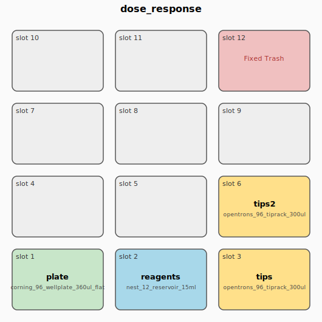
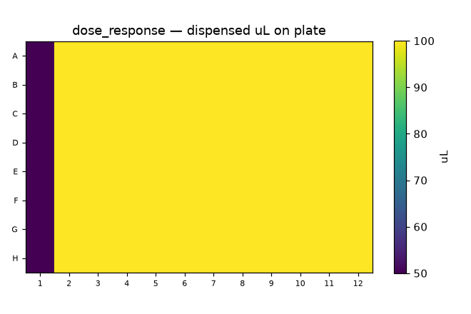

# PipetteC — a compiler for liquid-handling protocols

> Write a one-page experiment spec (or drop in a real Echo picklist). Get a **validated,
> tip-optimized Opentrons OT-2 protocol** that passes the official simulator in CI.


-blue)


PipetteC compiles a high-level YAML experiment spec — or a real Echo picklist CSV — into a
runnable Opentrons OT-2 Python protocol. It is built like a real compiler:

```
spec (YAML | Echo CSV) → TransferGraph IR → optimization passes → static validator → codegen → protocol.py → opentrons_simulate ✓
```

The optimizer **applies the published tip-saving formulation** (liquid handling as a capacitated
vehicle-routing / linear-programming problem) to cut disposable pipette tips dramatically, with a
machine-checked guarantee that the optimized protocol delivers *exactly the same liquid* as the
naive one. Every protocol it emits is validated by Opentrons' own `opentrons_simulate` on every
commit — so correctness isn't a claim, it's a green check. **No robot required.**

## Metrics — naive vs optimized (auto-generated)

Both columns are computed from the **same IR** (optimizer off vs on), so the comparison is
apples-to-apples and cannot be cherry-picked. Regenerate with `python benchmarks/bench.py --readme`.

<!-- BENCH:START -->
| Spec | Tips (naive) | Tips (opt) | Tip reduction | Steps (naive) | Steps (opt) | Time naive (min) | Time opt (min) |
| --- | ---: | ---: | ---: | ---: | ---: | ---: | ---: |
| dose_response | 184 | 13 | **-93%** | 184 | 107 | 49.1 | 16.0 |
| plate_normalization | 8 | 1 | **-88%** | 8 | 8 | 2.1 | 1.2 |
| cherry_pick | 5 | 4 | **-20%** | 5 | 5 | 1.3 | 1.2 |
| reformat_96_to_384 | 192 | 192 | **-0%** | 192 | 192 | 51.2 | 51.2 |
| pcr_setup | 48 | 25 | **-48%** | 48 | 48 | 12.8 | 9.7 |
| picklist (Echo) | 10 | 7 | **-30%** | 10 | 10 | 2.7 | 2.3 |
<!-- BENCH:END -->

The flagship **dose-response** benchmark clears a **≥60% tip reduction** bar (target ~75%),
enforced by `benchmarks/bench.py --check` inside the CI gate.

## Deck layout (flagship dose-response)





## The 30-second demo

```bash
pip install -e ".[dev]"                       # pins opentrons>=8.8,<9 (OT-2 simulate support)
pipettec compile examples/dose_response.yaml -o dose_response.py --report
opentrons_simulate dose_response.py           # the official tool agrees (exit 0)
```

The spec the user wrote:

```yaml
# examples/dose_response.yaml
template: serial_dilution
compounds: [DrugA]
points: 12
replicates: 8
top_conc_uM: 100
factor: 3          # 3-fold serial dilution
diluent: DMSO
transfer_volume_ul: 50
```

## What this project demonstrates

| Skill | Where it shows up |
| --- | --- |
| **Compiler engineering** | A real IR (`TransferGraph`), discrete optimization passes, deterministic code generation, and a *semantics-preservation* invariant proven by property tests — not a string-templating script. |
| **Applied operations research** | Implements the published CVRP/LP tip-saving formulation as compiler passes; the before/after table reports each metric's delta. |
| **Domain fluency (lab automation)** | Correct Opentrons API usage, deck geometry, labware/tip/well capacities, contamination rules, and the Echo picklist format. |
| **Testing rigor** | Hypothesis property tests (≥500 specs each), snapshot tests, a live `opentrons_simulate` gate, and a corpus/environment canary. |
| **Defensive/static analysis** | A validator that *rejects* impossible or unsafe specs (5 rejection classes) with clear diagnostics before any robot would move. |
| **Product & communication** | A CLI (`compile`/`validate`/`report`/`render`), generated deck SVG + plate heatmap, a resource report, and this README. |

## Architecture

Two front-ends lower to one IR; every pass rewrites the IR; codegen walks it. Passes never touch
YAML or Python text.

- **`TransferGraph` IR** — resources (labware, instruments), an ordered list of transfers
  `(source, dest, volume, tip_class)`, and *tip classes* (which transfers may safely share a tip).
- **Optimization passes** — multi-channel packing, source-grouped reordering, tip reuse, reagent
  batching. Each preserves the delivery map and contamination-safety.
- **Static validator** — capacity, empty-source, tip-exhaustion, deck-collision, contamination.
- **Codegen** — deterministic Opentrons API v2 (OT-2, `apiLevel` 2.15).

### The correctness invariant (the heart of the project)

Optimization must **never** change what liquid ends up where. Two properties, machine-checked over
hundreds of randomly generated specs:

1. **Delivery-equivalence** — the optimized IR delivers the same total volume for every
   `(source, dest)` pair as the naive IR.
2. **Contamination-safety** — a tip is reused across two transfers only if they belong to the same
   declared tip class.

## Prior art & how this differs

Being explicit about prior work is a deliberate credibility choice. **This project claims
execution and packaging, not algorithmic novelty.**

| Prior work | What it is | Why it's not this |
| --- | --- | --- |
| **Roboliq / PR-PR** ([repo](https://github.com/ellis/roboliq), [ACS Synth Biol 2018](https://pubs.acs.org/doi/abs/10.1021/acssynbio.8b00021)) | An AI-planning *compiler* from high-level protocols to optimized robot programs — the closest conceptual analog. | Scala/JS, **Tecan-only (no OT-2)**, research-grade. |
| **Tip minimization as CVRP/LP** ([NAR Genomics 2022](https://pmc.ncbi.nlm.nih.gov/articles/PMC9074407/), [Digital Discovery 2025](https://arxiv.org/html/2506.02795)) | Published OR formulations that minimize pipette tips, with code. | The optimization is *solved research*. PipetteC **applies** it and cites it; it does not claim to invent it. |
| **PyLabRobot** ([repo](https://github.com/PyLabRobot/pylabrobot), [paper](https://pmc.ncbi.nlm.nih.gov/articles/PMC10369895/)) | A hardware-agnostic Python **SDK** of atomic commands; supports OT-2. | An interface/runtime, **not a spec-compiler**; no optimizer, no Echo front-end. Complementary. |

**What's distinctive here** is the assembled artifact: OT-2 target · high-level spec **and** Echo
picklist front-ends · an IR with optimization passes · the official simulator as a CI gate · a
static validator · modern typed Python — readable and runnable in minutes.

## Reproducibility

```bash
python3 -m venv .venv && . .venv/bin/activate
pip install -e ".[dev]"
bash scripts/verify.sh          # ruff + mypy + pytest(≥85% cov) + simulate-all-examples + benchmark
```

A green run ends with the single line `VERIFY: ALL PASS`.

## Glossary (for non-lab readers)

- **OT-2** — Opentrons' benchtop liquid-handling robot; moves a pipette over a grid ("deck").
- **Well / plate** — one addressable cavity (e.g. `A1`); a 96-well plate is 8 rows × 12 columns.
- **Tip** — a disposable plastic pipette tip. Reusing tips *safely* is the core optimization.
- **Serial dilution** — repeatedly diluting to make a concentration series (a dose–response curve).
- **Echo picklist** — an industry-standard CSV of `(source well, dest well, volume)` rows.
- **`opentrons_simulate`** — Opentrons' official CLI that dry-runs a protocol and errors on
  anything invalid; our correctness gate.

## License

MIT.
